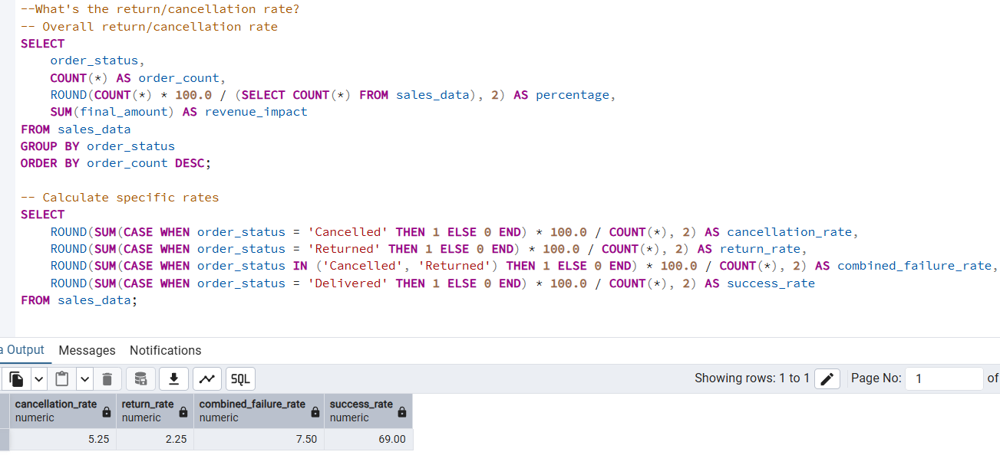
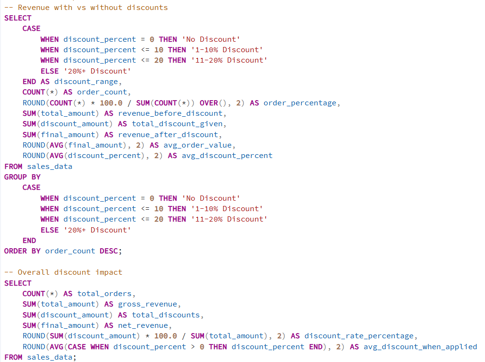

# Amazon Sales Analysis Dashboard  

This project is based on Amazon sales transaction data.  
The goal was to build a clear, interactive dashboard that helps a business owner track performance, understand trends, and monitor key KPIs efficiently.

Instead of jumping directly into Power BI, I followed a proper data workflow from raw data to final visualization.

---
# Preview:

## Project Workflow

Here’s how the project was executed:
### Step 1 — Data Cleaning (Excel)
- Imported raw sales data into Excel  
- Removed duplicates  
- Checked missing values  
- Applied data validation  
- Ensured consistent formatting  
- Cleaned discount and pricing columns  

### Step 2 — Data Analysis (SQL)
- Imported cleaned data into SQL  
- Wrote queries to extract business insights  
- Used GROUP BY, aggregations, and CTEs, also Window Function 
- Calculated KPIs and performance metrics  

### Step 3 — Visualization (Power BI)
- Connected Power BI directly to SQL  
- Imported structured data from SQL  
- Created data model  
- Built DAX measures (Return/Cancellation rate - Most important one.)
- Designed multi-page interactive dashboard with a Navigation bar 

---

##  Business Questions Solved Using SQL

1. Which country generates the highest revenue?  
2. What is the monthly sales trend?  
3. Which product category has the highest Average Order Value (AOV)?  
4. Top 5 best-selling products by quantity  
5. Payment method preference by country  
6. What is the return / cancellation rate?
     
8. Which shipping method performs best?  
9. How many repeat customers do we have?  
10. Which quarter performs best (seasonal trend)?  
11. Revenue comparison: With vs Without discounts
    

These questions helped shape the KPIs and dashboard structure.

---

## Dashboard KPIs

- Total Sales  
- Total Orders  
- Total Customers  
- Units Sold  
- Average Order Value  
- Cancel / Return %  
- Revenue by Country  
- Revenue by Category  
- Monthly Sales Trend  
- Payment Method Distribution  
- Shipping Method Usage  
- Repeat Customers  

---

## Tools Used

- Excel (Data Cleaning)  
- SQL (Data Extraction & Analysis)  
- Power BI (Visualization & Dashboard Design)  

---

##  Key Insights

- USA contributes the highest revenue.  
- Electronics dominates total sales.  
- Credit Card and Net Banking are the most preferred payment methods.  
- A small segment of repeat customers contributes significantly to revenue.  
- Return rate is around 7.5%.  
- Certain quarters show stronger seasonal performance.  

---

##  What This Project Demonstrates

- End-to-end data workflow (Excel → SQL → Power BI)  
- Strong SQL query writing  
- KPI building  
- Business-focused dashboard design  
- Analytical thinking  

---

If you’d like to review the dashboard or suggest improvements, I’m open to feedback.
